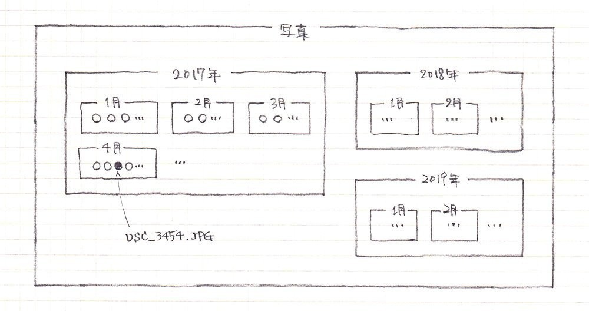
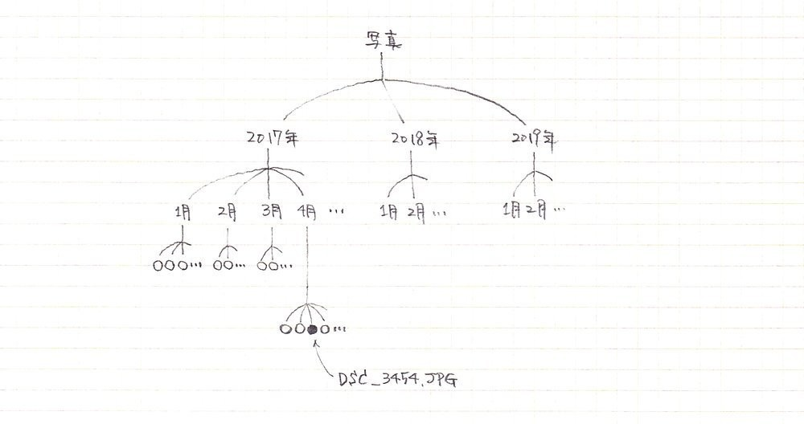

# ファイルとフォルダ

## パソコンの「ファイル」

パソコンは、文章や画像、動画、音楽といった情報ひとつひとつを「ファイル」という形で管理します。現実の世界で、例えば料理のレシピを書いたA4用紙を3枚ホチキスでとめたもの、それがパソコンのファイルに相当します。

現実の世界でファイルと言えば、書類のようなものを連想しますが、パソコンのファイルにそんな制約はありません。文章データ、画像データ、音楽データなど、あらゆるデータが、ファイルとして扱われます。

お絵かきソフトを使って年賀状のデザインを描いたとしましょう。そのお絵かきソフトには、あなたの絵を「保存する」機能があるはずです。保存すると、あなたの絵がファイルになります。保存しないと、次にパソコンの電源を入れたとき、あなたの絵は、もうそこにはありません(なぜならファイルになってないから)。

## ファイルの「名前」

ファイルには名前を付けることができます。ファイル名です。「無題」でもいいし、「年賀状2020」でも構いません。お絵かきソフトには、これまであなたが保存した絵の(つまりファイルの)一覧を表示する機能があるかもしれません。ファイル名をたよりに、10年前の年賀状でも探し出すことができるでしょう。

## ファイルはお絵かきソフトの中にある?

これまでのところでは、あなたの絵(あなたのファイル)が、「お絵かきソフトの中にある」ような気がするかもしれません。だって、お絵かきソフトの画面の中にあなたの絵が表示されてるのですから。

しかし、それは錯覚です。すべてのファイルは、OSが管理しています。つまり、WindowsやmacOSやLinuxです。お絵かきソフトは、OSに頼んでファイルの中身を取り出してあなたに見せてくれているのです。

## ファイルマネージャ

パソコンには、「ファイルマネージャ」という種類のソフトが入っています。Windowsパソコンの場合、「エクスプローラ」というソフトがそれです。Macなら「Finder(ファインダー)」という名前のソフトが標準で付いています。これらファイルマネージャの役割は、まさにファイルを管理することです。

ファイルマネージャは、パソコンにどんなファイルがあるかを一覧にして教えてくれます。そこには、あなたの年賀状ファイルだけでなく、他のソフトで作ったファイルも含まれます。ファイルマネージャを使えば、ファイルをコピーして複製を作ったり、ファイル名を変えたり、ファイルを削除することができます。

## フォルダ(あるいはディレクトリ)

ファイルは、「フォルダ」の中に入れることができます。現実の世界で、バインダーとかクリアフォルダーの中に書類を束ねたりできるのと同じです。フォルダのことを「ディレクトリ」と呼ぶこともありますが、フォルダとディレクトリは同義語です。

ファイルと同じように、フォルダにも名前を付けることができます。フォルダ名です。フォルダには、何個でもファイルを入れることができます。またフォルダの中には、別のフォルダを入れることだってできます(何個でも)。

ファイルマネージャはフォルダを管理するのも得意です。好きな名前のフォルダを作ったり、ファイルをフォルダから別のフォルダへ移動したりできます。

## フォルダ階層、フォルダツリー

デジカメで撮った写真ファイルが1000個あるとしましょう。全部まとめて「写真」フォルダに入っていると、3年前の桜の写真を探したいと思っても、なかなか大変かもしれません。写真のファイル名はデジカメが自動的に付けるので、「DSC_3454.JPG」みたいな感じで覚えにくいですしね。

そこで、「写真」フォルダの中に、「2017年」、「2018年」、「2019年」のようなフォルダを作り、さらにそれぞれの中に、「1月」、「2月」、…「12月」のようなフォルダを作って、その中に写真ファイル入れておきます。3年前の桜の写真は、「写真」フォルダの中の「2017年」フォルダの中の「4月」フォルダの中を探せば見つかるでしょう(3月や5月かもしれません)。

このように、フォルダを(マトリョーシカ人形のように)入れ子にすることによって、大量のファイルを分類して管理できます。パソコンでファイルやフォルダを扱うとき、この入れ子のイメージが頭に描けることがとても重要です。 例えば、こんな感じの階層状の図。

あるいは、枝分かれした木(上下逆さまに描くことが多い)に例えてもいいです。

## ファイルのパス、置き場、住所

3年前の桜の写真ファイルは、『「写真」フォルダの中の「2017年」フォルダの中の「4月」フォルダの中の「DSC_3454.JPG」』でした。毎回「△△フォルダの中の」と書くと長くなってしまうので、記号を使って短く書く決まりになっています。

使う記号は、OSによって異なり、

- Windowsの場合は、`写真¥2017年¥4月¥DSC_3454.JPG`
- macOSやLinuxの場合は、`写真/2017年/4月/DSC_3454.JPG`

です。

Windowsの記号は半角の`¥`(円マーク)、macOSは半角の`/`(スラッシュ)です。このような表記を、ファイルの「パス」と呼びます。ファイルへたどり着くための道筋、パス(path)です。ファイルの置き場を示した住所と考えても良いです。

パスを声に出して読み上げるときは、記号の部分を「の中の」とか「の下の」、あるいは単に「の」と発音して下さい。「`写真`の、`2017年`の、`4月`の下の、`DSC_3454.JPG`」みたいな感じです。

## 階層の頂上、木の根っこ

パスを下から上へ(右から左へ)さかのぼって見ると、

- `DSC_3454.JPG`ファイルは`4月`フォルダの中にあり、
- `4月`フォルダは`2017年`フォルダの中にあり、
- `2017年`フォルダは`写真`フォルダの中に

あります。

では、`写真`フォルダはどこにあるのでしょうか? たぶん別のフォルダの中にあるのでしょう。でも、その別のフォルダも、また別のフォルダの中にあるのかもしれません。いつ終わるのでしょうか? 安心して下さい。ルートフォルダで終わります。全てのファイルパスは、さかのぼるとルートフォルダにたどり着きます。root、つまり「根っこ」です。

ルートフォルダには名前がありません。「ルート」はフォルダ名ではなく、便宜上の呼称です。例の写真ファイルをルートフォルダからのパスで表記すると

- Windowsの場合は、`¥Users¥pon¥写真¥2017年¥4月¥DSC_3454.JPG`
- macOSの場合は、`/Users/pon/写真/2017年/4月/DSC_3454.JPG`
- Linuxの場合は、`/home/pon/写真/2017年/4月/DSC_3454.JPG`

みたいな感じになります。

先頭の記号がルートフォルダです。声に出すときは「ルートの下の」とか「ルートの」と言います。

## ドライブ(Windowsのみ)

パスに関して、Windows独特の概念があります。「ドライブ」です。「ドライブとは○○である」みたいな定義は気にしなくて構いませんが、ドライブがどんなものかは知っておく必要があります。

- Windowsパソコンには、複数のドライブが存在しうる
- ドライブごとに、ルートフォルダがある
- ドライブの名前は、アルファベット1文字である(大文字、小文字は区別しない)
- ドライブ名のことを、「ドライブレター」と呼ぶことがある
- 通常、Cドライブを使う
- ハードディスクを増設したり、USBメモリを指したり、DVDやブルーレイを装着すると、新しいドライブ(DとかEとか)が増える

ドライブも含めてパスを表記するときは、

- `C:¥Users¥pon¥写真¥2017年¥4月¥DSC_3454.JPG`のように書き
- 「`C`の、`ルート`の、`Users`の……」とか、単に「`C`の`Users`の……」

と読みます。

## 絶対パス、相対パス

ルートから始まるパス(Windowsの場合はドライブレターから始まるパス)のことを「絶対パス」と呼びます。例えば、macOSでの、`/Users/pon/写真/2017年/4月/DSC_3454.JPG`は、絶対パスです。

OSが管理するファイルやフォルダ全体のことを「ファイルシステム」と呼びますが、絶対パスは、ファイルシステムの中でファイルやフォルダを一意に特定する手段です。都道府県名から書いた住所みたいなものです。別々のファイルが、同じ絶対パスを持つことはありえません。

これに対して、ルートから始まらないパス(Windowsの場合はドライブレターから始まらないパス)は、相対パスと呼ばれます。相対パスは、ある絶対パスを基準にして、そこからの相対的な位置を表現するものです。

相対パスだけでは、ファイルやフォルダを一意に特定することはできません。「大手町1丁目1-1」が、東京や愛媛や広島に存在するのと同じです。

