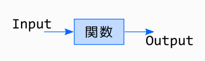
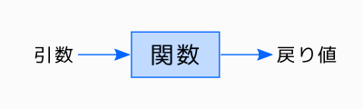
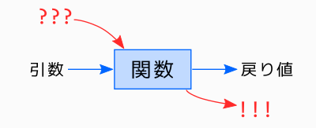
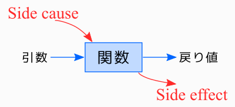

# ピュア関数

ピュア関数(pure function)。直訳すると「純粋な関数」。関数といえば、プログラミングに欠かせない道具です。その関数が「純粋」とは、どういう意味でしょうか?

※まだ「関数」自体に馴染みの薄い方は、先に末尾の「おまけ」を読んでみてください。

## 関数の入出力

関数には、インプットとアウトプットがあります。

インプットは、関数の引数(ひきすう)のことです。英語で言うとパラメータ(Parameter)とかアーギュメント(Argument)です。一方アウトプットは、関数の戻り値です。return値と呼ぶこともあります。

引数と戻り値は、関数の正式な入口・出口です。

## 不純な関数

しかし、現実の関数には、引数や戻り値以外にもインプット・アウトプットはあります。

例えば、「今日の日付を返す関数」を考えてみましょう。この関数に引数はありません。情報源は、コンピュータが内蔵している時計なので、引数は不要なのです。

また、「チャイム音を再生する関数」を考えてみましょう。この関数の役割はスピーカを鳴らすことなので、戻り値は不要ですね。

こういった、正式な入口以外から侵入してくるインプットや、正式な出口以外へ漏れ出ていくアウトプットを、それぞれ、Side cause、Side effectと呼びます。

Side effectは、日本語にすると「副作用」です。単にeffectと呼ぶケースもあります。その場合、Side causeの方はcoeffectと呼びます(あんまり耳にする機会は無いと思いますが)。一方、Side causeの方には、適当な日本語がありません。「引数以外の入力」とでも呼ぶしかなさそうです。

Side causeの例は、前述の「時計」以外にも、以下のようなものが挙げられます。

- グローバル変数の参照
- ファイルを読む
- ネットワークからデータを受信する
- キーボードから入力を得る

またSide effectの例も、いろいろあります。

- グローバル変数の値を変更する
- ファイルに書く
- ネットワークへデータを送信する
- モニターに文字やグラフィックを表示する

## 純粋な関数

純粋な関数の条件は以下の2つです。

- Side causeを持たない
- Side effectが無い

Side causeを持たないということは、引数のみによって関数の挙動が決まるということです。同じ引数を与えれば、必ず同じ結果を返すはずです。このような性質のことを参照透過性(Referential Transparency)と呼びます。

一方、Side effectが無いということは、その関数は、戻り値を返すこと以外には外界に何の作用も与えないということです。

## 純粋な関数の利点

純粋な関数は、まず、「呼びやすい」です。引数を準備するだけで呼べます。不純な関数の場合は、そうはいきません。そいつが必要としているSide causeの準備もできてないとダメです。グローバル変数の値がnullだったり、ファイルが存在しない状態で関数を呼ぶと、フリーズしてしまうかもしれません。

呼びやすさは、「テストしやすい」に繋がります。いろんな引数を指定しながら呼ぶ。Side effectが無いので、アウトプットの正しさを確認するのも、戻り値をチェックするだけでOKです。つまり「テストを自動化しやすい」のです。もしSide effectがあったら、期待通りのeffectが生じたかどうかを確認しないとテストしたことになりません。チャイムが鳴ったことの確認を自動化するのは大変ですよね。

またSide effectが無い関数は、再利用しやすいです。戻り値を利用したいだけなのに、余計なSide effectがあるせいで再利用できない、なんてケースは良くあります。

## メモ化

純粋関数を高速化するため、「メモ化」という技法がよく使われます。引数に対する戻り値を(関数内部に)メモっておいて、次に同じ引数で呼ばれたとき、覚えておいた値を返すようにすれば、計算の手間を省けます。参照透過だからこそ成せる技ですね。また副作用が無いので、呼び出し側には計算をサボっていることはバレません。

## 避けられない汚れ仕事

プログラム全てを純粋関数だけで組み立てるのは不可能です。なので、なるべく沢山の純粋関数と、少しの不純な関数でプログラムを作るように心がけましょう。

例えば、引数をもらって、何らかの演算を行い書式化して画面へ出力する(不純な)関数があるなら、2つの関数に分けてやると良いでしょう。演算と書式化の部分は純粋関数として実現できます。そいつが返す書式化結果を、もう1つの(不純な)関数が画面へ出力するのです。こんな感じで、純粋関数の割合を増やすことができます。

## おまけ 〜 そもそも関数とは?

プログラムは、コンピュータ(CPU)への命令を記述した指示書のようなものです。プログラムが複雑になると指示内容も膨大になるので、頭から順にひたすら列挙していくスタイルだと、全体を把握しにくいし、メンテナンスも面倒です。そこで、プログラムをいくつかのパーツに分ける(「構造化する」と表現したりします)手法が、いろいろと考案されています。その手法の一つが、「関数(function)」です。

例えば、電卓プログラムを作りたいとしましょう。以下のような関数に分けます。

- `1+1=`など、ユーザの入力を受け取る関数
- 受け取った入力を解読する関数
- 解読結果に基づいて、答えを計算する関数
- 計算結果を表示する関数
- 上記の4つの関数を、順に呼び出す関数

1つの関数の中の処理を、更に複数の関数に分解することも可能です。例えば「ユーザの入力を受け取る関数」は、以下のような処理に分けることができます。

- 「式を入力してください」のような、入力を促すメッセージを表示する
- 入力を待ち、入力文字列を受け取る
- 式として妥当かどうかをチェックする(`1+*2=`とかはNG)
- 妥当でない場合は、メッセージを表示して、再度入力を待つ
- 妥当な場合は、終了する

これらの処理のうち、いくつかは、関数としてパーツ化しても良いかもしれません。パーツ化しておくと、別の関数の中で再利用できたりして便利です。
