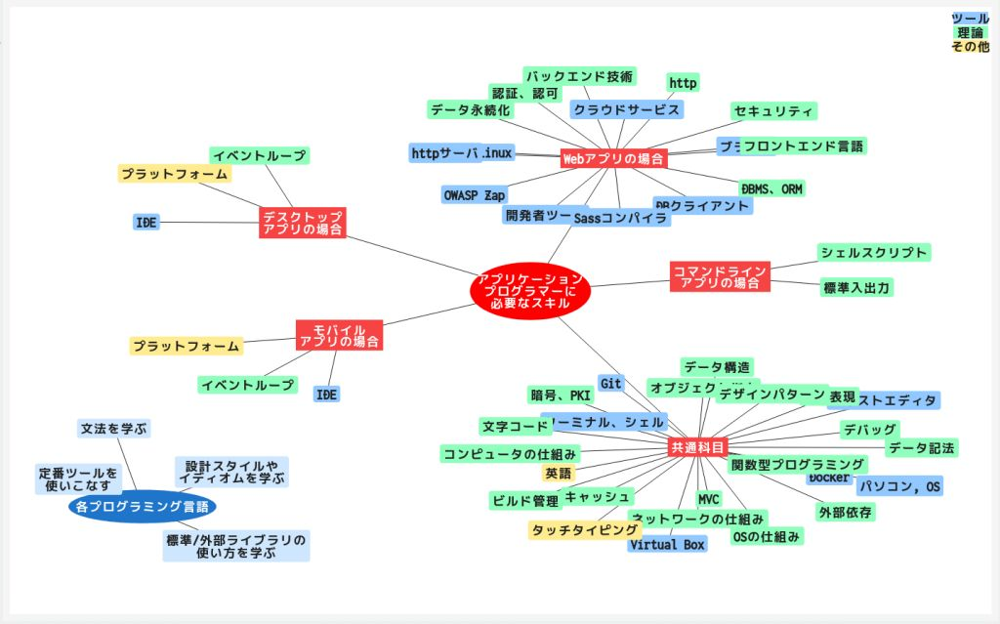

# プログラマーへのロードマップ

プログラマーになるために、身につけておきたいスキルや知識を整理してみます。プログラマーの中でも、特に、アプリケーション・プログラマーを対象にします。

個々のプログラミング言語に依存する話しは除きますが、最後にちょっとだけ、新しいプログラミング言語を学ぶときのアプローチを考察します。

## アプリケーション・プログラムの種類

アプリケーション・プログラムにも、いろんな種類があります。プログラムの種類によってロードマップにも違いが出ると思います。

- コマンドラインアプリ
- デスクトップアプリ
- モバイルアプリ
- Webアプリ

# 1.共通科目

まずは、開発するプログラムの種類に関係なく、どんなプログラマーにも共通する要素から。

## ツールの使いこなし

### パソコン、OS

これが無いと始まらない。

Windows, Mac, Linux、どれか1つ、メインで使いこなせること。できれば、3つとも、ある程度は使えるようになっておくと楽。

アプリを起動したり、特定のフォルダを開いたり、頻繁に行う操作のショートカットキーを覚えておくと、作業効率が上がる。

### テキストエディタ

プログラマーが最も頻繁に使うソフトウェア。

お気に入りのテキストエディタを1つ見つけよう。シンタックスハイライトやインデントの自動調整など、プログラミングを支援する機能を持ち、プラグインにより機能強化できるものを選んだほうが良い。

- [参考記事「テキストエディタ」](https://github.com/gpsoft/ksp/blob/master/articles/editor.md)

ショートカットキーを駆使して、入力/編集操作を効率的に行えるようにしよう。

### ターミナル、シェル

コンピュータを操作するための原始的なインターフェイス。場合によっては、GUIとマウスよりも効率が良い。

- [参考記事「ターミナル」](https://github.com/gpsoft/ksp/blob/master/articles/terminal.md)

基本コマンドやリダイレクトを使えること。シェルスクリプトやバッチファイルが書けると、定形作業や大量操作を自動化できる。

### Git, GitHub

ソースコードのバージョン管理に使う。他のを選ぶ理由が無い限り、Gitを使うのが無難。

ついでにGitHubも覚えておけば、ソースコードの共有やバックアップ代わりにもなる。

### Docker

ホスト環境を汚さずに、開発環境を構築できる。Virtual Boxの方が好き、という人でも、1度はDockerも使っておきたい。

### Virtual Box

ホスト環境を汚さずに、開発環境を構築できる。Dockerの方が好き、という人でも、1度はVirtual Boxも使っておきたい。

## 理論、概念、原理の理解

### コンピュータの仕組み、プログラムが動く仕組み

CPU、レジスタ、ROM、RAM、I/O、スタック、ヒープなど。自分のプログラムの下に何があるか、少しでも知っておくと良い(知らない概念に遭遇したとき、想像力が働きやすい)。

### OSの仕組み

プロセス、スレッド、非同期処理、割り込み処理、ファイルシステムなど。自分のプログラムの下に何があるか、少しでも知っておくと良い(知らない概念に遭遇したとき、想像力が働きやすい)。

- [参考記事「ファイルとフォルダ」](https://github.com/gpsoft/ksp/blob/master/articles/filedir.md)

### ネットワークの仕組み

IPアドレス、socket, port、TCP, UDP、ホスト名、ドメイン名、DNS、Macアドレスなど。自分のプログラムが他のプログラムとどうつながるのか、少しでも知っておくと良い(知らない概念に遭遇したとき、想像力が働きやすい)。

### 文字コード

文字セットと符号化方式の話し。文字化けに出会っても、パニックにならないために。

- [参考記事「テキストとバイナリ」](https://github.com/gpsoft/ksp/blob/master/articles/text.md)
- [参考記事「文字コードの話し」](https://github.com/gpsoft/ksp/blob/master/articles/charset.md)

### データ構造

配列、リスト、ツリー、キュー、スタック、ハッシュマップ、タプルなど。用途に適したデータ構造を選択できるように。

- [参考記事「ハッシュマップ」](https://github.com/gpsoft/ksp/blob/master/articles/hashmap.md)
- [参考記事「タプル」](https://github.com/gpsoft/ksp/blob/master/articles/tuple.md)

### 正規表現

検索、置換、部分文字列の抽出、バリデーションチェックなど、応用範囲が広い。

### 暗号、PKI

セキュリティの話し。避けて通るのは難しい。

- [参考記事「電子証明書、鍵ペア、公開鍵、PKI」](https://github.com/gpsoft/ksp/blob/master/articles/pki.md)

### オブジェクト指向プログラミング(OOP)

多くのプログラミング言語が採用しているパラダイム。クラスとクラス継承によりプログラムを組み立てるスタイル。

### 関数型プログラミング(FP)

ピュア関数と関数合成や高階関数によりプログラムを組み立てるスタイル。OOPな言語でも、部分的にFPスタイルを取り入れていることが多い。

- [参考記事「ピュア関数」](https://github.com/gpsoft/ksp/blob/master/articles/purefunc.md)

### MVC

GUIアプリの典型的な構造パターン。コマンドラインアプリ専門の人には不要。

### デザインパターン

OOPでよく使われる。クラス間の役割分担を決めるときのガイドライン。

### 外部依存

外部ライブラリや外部サービス(Web APIなど)を使ってプログラムを組み立てる、という戦術を理解する。

### ビルド管理、パッケージ管理

書いたプログラムや使う外部ライブラリを管理し、最終成果物を生成するために、どんなプロセスが必要かを理解する。

### データ記法

JSONとかYAMLとかXMLとかの話し。

### デバッグ

デバッグ技法の話し。エラーメッセージ、printfデバッグ、ブレークポイント、スタックトレース。

ロギング、テストの自動化についても。

### キャッシュ

キャッシュという発想について。

## その他

### 英語

ネーミングには、ある程度のボキャブラリと文法知識が必要。読解力があれば、英文マニュアルや英文サイトから情報を吸える。リスニング力があれば、YouTubeの動画で勉強できる。

### タッチタイピング

習得に時間と忍耐が必要だが、リターンは計り知れないほど大きい。

# 2.コマンドラインアプリのプログラマー

## 理論、概念、原理の理解

### シェルスクリプト

使うシェルを選択し、そこで使える文法を学ぶ。WindowsならコマンドプロンプトやPowerShell、Mac/Linuxならbashやzshなど。

### 標準入出力

キーボード入力と画面出力。

# 3.デスクトップアプリのプログラマー

## ツールの使いこなし

### IDE

Eclipse, Visual Studio, IntelliJ IDEAなど。

## 理論、概念、原理の理解

### イベントループ

多くのGUIアプリは、イベントループ(とイベントハンドラ)で構成される。

## その他

### プラットフォーム

.Net(CLR)、Electron、JVM(JavaFX, Swing)、Gtk, Tcl/Tkなど。

# 4.モバイルアプリのプログラマー

## ツールの使いこなし

### IDE 

Android Studio, Xcodeなど。

## 理論、概念、原理の理解

### イベントループ

多くのGUIアプリは、イベントループ(とイベントハンドラ)で構成される。

## その他

### プラットフォーム

React Native, Flutterなど。

# 5.Webアプリのプログラマー

## ツールの使いこなし

### ブラウザ

これが無いと始まらない。Chrome系、Firefox、Safari、IE11など。

### ブラウザの開発者ツール

フロントエンドのデバッグに欠かせないツール。

- [参考記事「開発者ツールの紹介」](https://github.com/gpsoft/ksp/blob/master/articles/devtools.md)

### DBMSのクライアントツール

直接的にDBの中身を参照したり更新できること。

### Linux

本番環境としてLinuxを使うことが多いので、いざというときのために慣れておきたい。

### httpサーバ

使用するhttpサーバ(Apache httpdなど)のインストールや、基本的な設定ができると良い。

### Sassコンパイラ

Sassを使うプロジェクトでは必須。

### OWASP Zap

Webアプリの脆弱性を見つけるためのツール。

### クラウドサービス

Heroku, AWS, GASなど、必要に応じて。

## 理論、概念、原理の理解

### http

- httpとhttps
- GET, POST, PUT, ...
- ヘッダとボディ
- Cookie
- ベーシック認証
- CORS
- Web socket

### フロントエンドの言語

- HTML
- CSS(Sass)
- JavaScript
- jQuery
- Bootstrap

### バックエンドの技術

- SQL
- HTMLテンプレート

### データ永続化

- DB
- セッション
- Local storage

### DBMS、ORM

- DBMS
- トランザクション
- ロック
- ORM

### 認証、認可

- 認証(Authentication)
- 認可(Authorization)

### セキュリティ

- XSS
- CSRF
- SQLインジェクション

# 6.汎用プログラミング言語の習得

## 学習のゴール

学習のゴールを3種類に分けてみましょう。

- 理解する ...「なるほど」と感じること。他人に説明できる。それを土台にして新しい概念を生み出せる。
- 暗記する ...すぐに取り出せる知識。作業の効率化に影響する。
- 経験する ...暗記不要。「調べた」、「やってみた」、「メモってある」で十分。

学習対象に応じて、どれをゴールにするか適切に判断しましょう。

例えば、理解すべきなのに暗記しただけで安心してしまってはいけません。理解すれば応用が効くはずですが、暗記した知識は応用につながりにくいです。

また、経験しておけば十分なのに、暗記しようとするのは、もったいないです。暗記量には上限があると思うので、使用頻度が高いものに使いましょう。

## 学習対象

どのプログラミング言語を学ぶにしろ、共通する4つの柱があります。

- 文法を学ぶ
- ツールの使いこなしを学ぶ
- ライブラリの使い方を学ぶ
- 設計スタイルやイディオムを学ぶ

いま自分が何を(どの柱を)学んでいるのか意識して情報を整理すれば、覚えることの多さに圧倒されなくてすむかもしれません。

## 文法を学ぶ

公式サイトや書籍で文法を学びます。文法は単なる表記の問題なので、すぐにマニュアルを参照できるようにしておけば良いでしょう。使用頻度に応じて、自然と暗記してしまうと思います。

文法を学ぶ過程で、「変数」や「`if`文」といった、多くのプログラミング言語に共通する概念も学ぶことになると思いますが、こっちの方は「理解すべき」対象です。

## ツールの使いこなしを学ぶ

その言語の、標準的なツールや定番のツールの使い方を習得する必要があります。例えばJavaなら、`javac`, `java`, `jar`, IDE, Maven, JUnitなどです。

まずは最低限必要な使い方を覚えれば良しとしましょう。ただし、習熟すればするほど作業効率は上がるし、「もしこの機能を知らなかったら、このバグは解決できなかっただろう」なんてことがあるのも事実です。

## ライブラリの使い方を学ぶ

標準ライブラリやサードパーティのライブラリ、フレームワーク、外部サービスなどの使い方を学びます。

いろんなライブラリを知っているほど効率は上がります(ライブラリを知らなければ、すべて自分で書くしかありません)。一方、人気の外部ライブラリは進化も早く、せっかく覚えた知識が陳腐化しやすい傾向があると思います。

## 設計スタイルやイディオムを学ぶ

例えば外国語を学習する場合、よく使われる「言い回し」や「慣用句」を覚えると、流暢な文章が書けるようになったりしますが、プログラミング言語の学習にも同じことが言えます。その辺が分かってないと、たとえ文法的に間違ってなくても、不自然な理解しにくいコードになってしまう危険があります。

こういった慣例やイディオムだけを集中して学習するのは難しいと思います(そういう教材が少ない)。何か他のことを勉強しているときに学習チャンスが隠れてるかもしれないので、見逃さないようにしてください。

- その言語の公式サイトにあるサンプルコードを読むとき
- 上級者が書いたコードを読むとき
- 上級者にコードレビューしてもらうとき

また、慣例やイディオムに出会ったときは、できるだけ、なぜそう書くのかを理解しましょう。理解すれば定着しやすいし、応用したり、そのスタイルを敢えて破ったりすることも可能です。
