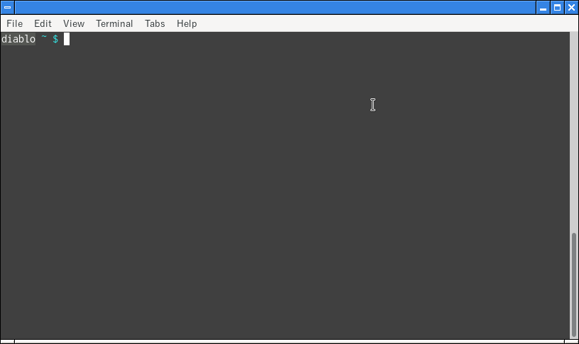
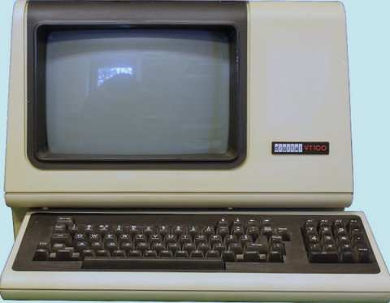

# ターミナル

ターミナルは、プログラマーなら是非とも使いこなせるようになっておきたいツールの一つです。ターミナルが苦手だったり、避けているプログラマーも多いかもしれませんが、ターミナルが必要な状況は、ある日突然やってきます。そんなとき、手も足も出ないなんてことにならないよう、最低限のスキルは身につけておくべきです。

Windowsのターミナルサポートは、他のOS(macOSやLinux)に比べると特殊です。そこで本記事では、まずmacOSやLinuxのターミナルに関して述べ、最後にWindows独特の情報を補足します。

## ターミナルとは

「ターミナル(terminal、端末)」には、いろんな別名があります。黒い画面、仮想ターミナル(仮想端末)、ターミナルエミュレータ(端末エミュレータ)、CUI(Character User Interface)、CLI(Command Line Interface)、コンソール、などなど。全部、同じものを指します。

↓これがターミナルの一例です。



ターミナルを開くと、「シェル(shell)」と呼ばれる種類のプログラムが実行されます。シェルは、プロンプトを表示して、あなたからの指示を待ちます。上の例では、`diablo ~ $`というのがプロンプトです。

ターミナルとシェルは一心同体です。この記事はターミナルを解説したものですが、ここで紹介する操作の一部は、実際はシェルの機能かもしれません(その辺は厳密に区別しません)。

## コマンドライン

シェルのプロンプトに対して、あなたは指示を入力し、Enter(macOSならReturn)キーを押します。この指示内容のことを「コマンドライン」と呼びます。コマンドラインは、コマンドと、任意の数の「引数」で構成されます。コマンドと引数は半角スペースで区切る決まりです。引数の中でも、`-`で始まるものは特別に「オプション」と呼ばれます。

例を挙げましょう。

```shell-session
diablo ~ $ ls ~/dev/java/ws01 -a
```

- `ls`がコマンド
- `~/dev/java/ws01`と`-a`が引数
- 中でも、`-a`はオプション

`ls`コマンドは、引数に指定されたディレクトリに存在するファイルやディレクトリの一覧を表示します("list"の略)。試しに、ルートディレクトリの下を調べてみましょう。

```shell-session
diablo ~ $ ls /
bin   dev  home  lib64       mnt  proc  run   srv  tmp   var
boot  etc  lib   lost+found  opt  root  sbin  sys  usr
```

## カレントディレクトリ

ターミナルで作業するとき、(あなたは)必ずどこかのディレクトリに「居ます」。いまどこに居るかを示すのが、「カレント(current)ディレクトリ」です。「作業(working)ディレクトリ」と呼ぶ場合もあります。カレントディレクトリを調べるには`pwd`コマンドを使います("print working directory"の略)。

```shell-session
diablo ~ $ pwd
/home/maru
```

カレントディレクトリを変えるには`cd`コマンドを使います("change directory"の略)。

```shell-session
diablo ~ $ cd /mnt
diablo /mnt $ 
```

カレントディレクトリを変えることを「移動する」と表現することがよくあります。上記例では、「`/mnt`へ移動した」わけです。「移動」というとファイルの移動を連想するかもしれませんが、混同しないよう注意してください。

カレントディレクトリを移動したあと、元のディレクトリへ戻りたいときは、`cd -`とすれば良いです。

`ls`コマンドを引数なしで使うと、カレントディレクトリの中のファイルやディレクトリをリストアップできます。

```shell-session
diablo /mnt $ ls
backup  ipod  pub  usb
```

## 相対パス

ファイルやディレクトリのパスを表記する方法には、「絶対パス」と「相対パス」があります(パスに関して、詳しくは「[ファイルとフォルダ](articles/filedir.md)」の項を参照)。ターミナルのコマンドラインで相対パスを使った場合、それは、カレントディレクトリを基準にして解釈されます。同じ相対パスでも、カレントディレクトリが変われば、それが指す物が変わります。

相対パスで表記するとき、`.`は「カレントディレクトリ自身」を示し、`..`は「カレントディレクトリの1つ上のディレクトリ」を示します。例えば、カレントディレクトリが`/mnt`の場合、以下はすべて同じものを示しています。

```
/mnt/ipod
./ipod
../mnt/ipod
```

相対パスが`./`で始まるとき、`./`の部分は省略しても構いません。例えば、`ipod`ディレクトリの下を見たいときは、以下のどちらでも良いです。

```shell-session
$ ls ./ipod
$ ls ipod
```

## ホームディレクトリ

ファイルシステムには、ログインした「あなた」専用のディレクトリがあります。それを「ホームディレクトリ」と呼びます。あなたのユーザ名が`hoge`なら、ホームディレクトリのパス(絶対パス)は、以下のようになります。

```
/home/hoge        # Linuxの場合
/Users/hoge       # macOSの場合
```

相対パスを`~`で始めるとき、`~`の部分はホームディレクトリに置き換えて解釈されます。例えば`~/dev`は、Linuxでは`/home/hoge/dev`を指します。

`cd`コマンドを引数なしで使うと、ホームディレクトリへ移動できます。

```shell-session
diablo /mnt $ pwd
/mnt
diablo /mnt $ cd
diablo ~ $ pwd
/home/maru
```

## プロンプト

前述の`cd`コマンドの例のところで、移動するにつれてプロンプトの内容が変わったことに気付いたでしょうか。実はこのプロンプトには、3つの情報が含まれています。

- コンピュータ名(`diablo`)
- カレントディレクトリ(`/mnt`や`~`)
- モード(`$`)

モードには、`$`の他に`#`があります。`$`は、一般ユーザとしてコンピュータを操作していることを示しており、この場合、できる操作が、ある程度制限されます。一方、制限無しの「スーパーユーザ(あるいはrootとも呼ぶ)」として操作するときは、`#`になります。

プロンプトの内容は、シェルの設定によって異なるので、あなたのターミナルでは、上記とは若干異なる設定になっている可能性が高いです。

## 隠しファイル、隠しディレクトリ

2通りの方法で、筆者のPCの`~/dev/java/ws01`ディレクトリの中を見てみましょう。

```shell-session
diablo ~ $ cd ~/dev/java/ws01
diablo ~/dev/java/ws01 $ ls
hello
diablo ~/dev/java/ws01 $ ls -a
.  ..  .metadata  .recommenders  hello
```

このように、通常の`ls`コマンドは、パスが`.`で始まるファイルやディレクトリを表示しません。これらのファイルは隠しファイルや隠しディレクトリと呼ばれます。これらを表示するには`-a`オプションを付ける必要があります。

## 環境変数

ターミナル上では、「環境変数(environment variables)」と呼ばれる変数が使えます。代表的なものを挙げましょう。

| 環境変数|用途 |
| :------ | :-- |
| `SHELL`|シェルプログラムのパス。 |
| `PWD`|カレントディレクトリのパス。 |
| `HOME`|ホームディレクトリのパス。 |
| `USER`|ユーザ名。 |
| `PATH`|コマンドを検索する場所。 |

ターミナルを使うときに最も重要な環境変数が`PATH`です。`PATH`には、複数のディレクトリパスを`:`で連結して設定します。環境変数の現在値を調べるには、`echo`コマンドを使うと良いでしょう。

```shell-session
diablo ~ $ echo $PATH
/home/maru/local/bin:/usr/local/bin:/usr/bin:/bin:/usr/local/sbin
```

あなたがコマンドを入力したとき、シェルは、`PATH`で示されたディレクトリを検索して、そのコマンドを探します。見つからない場合は、エラーになります。

```shell-session
diablo ~ $ hey
bash: hey: command not found
```

別の言い方をすると、ターミナル上でコマンドを実行するとき、そのコマンドは、`PATH`に設定されたディレクトリのどれかの下に存在していなければなりません。このことを一般に「コマンドへ`PATH`が(つまり道が)通っている」と表現します。新しいツールをインストールしたら、そこへ「`PATH`を通す」ことを忘れないようにしましょう。

## コマンド履歴

`history`コマンドを使うと、いままでに打ったコマンドを一覧できます。

```shell-session
diablo ~ $ history
  ... 中略
  545  ls /
  546  pwd
  547  cd /mnt
  548  ls
  549  ls ipod
  550  cd
  551  cd ~/dev/java/ws01
  552  ls
  553  ls -a
  554  cd
  555  echo $PATH
  556  hey
  557  history
```

`!`に続けて番号を打てば、該当するコマンドを再実行できます。

```shell-session
diablo ~ $ !551
cd ~/dev/java/ws01
diablo ~/dev/java/ws01 $ 
```

また、プロンプトに対して`<Ctrl>+p`や`<Ctrl>+n`と打てば、自由にコマンド履歴を行き来することができます(previousとnextの略)。

## マニュアル、ヘルプ

コマンド名が分かっていて、その使い方が知りたいときは、`man`コマンドでマニュアルを表示することができます。

```shell-session
diablo ~ $ man pwd
```

また、多くのコマンドは、`--help`オプションをサポートしています。

```shell-session
diablo ~ $ pwd --help
pwd: pwd [-LP]
    Print the name of the current working directory.

    Options:
      -L  print the value of $PWD if it names the current working
          directory
      -P  print the physical directory, without any symbolic links

    By default, `pwd' behaves as if `-L' were specified.

    Exit Status:
    Returns 0 unless an invalid option is given or the current directory
    cannot be read.
```

## よく使うコマンド

ターミナルで使えるコマンドは無限にあります。もちろん全てを覚える必要はありません。よく使うコマンドを挙げておきます。

```
ls
pwd
cd
echo
history
man
mkdir    # ディレクトリを作成
touch    # 既存ファイルのタイムスタンプを更新(または空ファイルを作成)
cat      # ファイルの内容を表示
cp       # ファイルやディレクトリをコピー
rm       # ファイルやディレクトリを削除
mv       # ファイルやディレクトリを移動
find     # ファイルシステム内の、ファイルやディレクトリを探す
grep     # ファイルの内容を検索する
```

## Windowsでは

Windowsにも、「コマンドプロンプト」や「パワーシェル」といったターミナル/シェル機能があります。しかしWindowsのターミナルは、Linux/macOS勢とは少し文化が異なっています。

- 使えるコマンドのラインナップが違う(`ls`の代わりに`dir`とか)
- コマンドラインのオプションは、`-a`ではなく`/a`のように表記する
- 環境変数`PATH`では、フォルダを`:`ではなく`;`で連結する

Windowsで、Linux/macOSスタイルのターミナルが使いたい場合は、Git for Windowsに同梱されている`bash`がオススメです。Gitの`bash`では、パスにはLinux/macOSスタイルの表記を使うことができます。またパスについても、Linux/macOS的な表記が可能で、例えば、Windowsの`c:\hoge\fuga\piyo.txt`は、`/c/hoge/fuga/piyo.txt`と表記できます。`cd`や`ls`、`history`といったコマンドも使えます。

## おまけ 〜 本当のターミナルとは

ところで、本来のターミナルは、こんなやつです。



見ての通り、キーボードとモニターですね。古臭い感じのパソコンに見えるかもしれませんが、パソコンではありません。この箱の中にはコンピュータは入ってなくて、ちょっと離れたところにある大型のコンピュータとケーブルでつながっています。

昔々、コンピュータが超高価だったころは、コンピュータに、こんな「ターミナル」を何台もつなげて、みんなで1つのコンピュータを共同利用していました。このモニタにはプロンプトが表示され、そこへ、キーボードでコマンドを打ち込んでいたわけです。この記事で学んだターミナルは、現代のコンピュータ上で、本来のターミナルを模倣した(エミュレートした)ものです。
