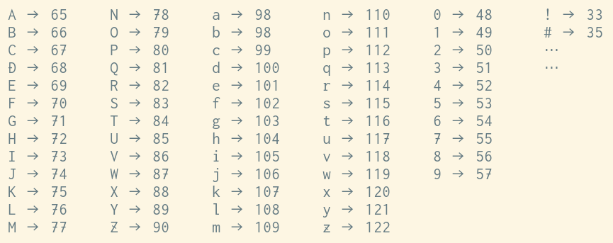

# テキストとバイナリ

パソコンが扱うファイルには、テキストファイルとバイナリファイルの2種類があります。プログラミングを始めると、早い段階で、両者の違いを意識する必要に迫られると思います。

## テキストファイルとバイナリファイル

テキストファイルは、文字のみを格納したファイルです。プログラムのソースファイルがその例です。HTMLファイルやCSSファイルもそうです。一方、バイナリファイルは、テキストファイル以外のすべてのファイルです。写真や音楽ファイル、Windowsの実行ファイル(exe)などがあります。

マイクロソフトの「ワード」で手紙を書いたとしましょう。`Letter.docx`という名前でファイルに保存しました。これは文章を格納したファイルです。テキストファイルでしょうか? いいえ、これはバイナリファイルです。文字のみでなく、文字のサイズやスタイル、段落の間隔、ページ余白などの情報も格納しているからです。ちなみに、こういった装飾情報を含んだ文章を「リッチテキスト」と呼んだりします。

## 見分け方

実は、テキストファイルとバイナリファイルを見分ける(簡単な)方法はありません。誰かから`Hoge`というファイルをもらったとして、あなたには、それがテキストかバイナリか(簡単には)分からないのです。

では、どうするか。ファイルの中身を見てみて、テキストファイルっぽければテキストファイル、そうでなければバイナリファイル、ということになります。でも、「テキストファイルっぽい」とは、どういうことなのでしょうか。

## テキストエディタ

ファイルの中身を見るには、そのためのソフトが必要です。パソコンには、「テキストエディタ」と呼ばれる種類のソフトが入っています。Windowsなら「メモ帳」が、macOSなら「テキストエディット」が、標準で付いているテキストエディタです。テキストエディタの役割は、テキストファイルを表示したり編集することです。

プログラムのソースファイルはテキストファイルですから、テキストエディタは、プログラマーにとって最も重要なソフトと言って良いでしょう。プログラマーの多くは、OS標準のメモ帳などではなく、お気に入りの高機能なテキストエディタをインストールして使っています。

話しを`Hoge`ファイルに戻しましょう。`Hoge`をテキストエディタで開いてみて、ちゃんと開ければ、それはテキストファイルっぽいということです。「ちゃんと開ける」というのは、ファイルに含まれた文字情報が正確に表示されるという意味です。

とは言え、ファイルの中身を知らない人には、表示されたものが正確かどうか判断できません。仮に「おもてなし」と表示されたのなら、たぶん正確なんだろうと納得できそうです。でも、`#~A(BFF)A~*2=`と表示されてたらどうでしょう。正確じゃないと言い切れるでしょうか。`Hoge`は、`#~A(BFF)A~*2=`という文字情報を格納したテキストファイルなのか? それとも、実はバイナリファイルで、それをテキストエディタで開いてしまったせいで妙な文字が表示されたのか?

これを解明するには、もっと原始的なレベルでファイルの中身を見てみる必要があります。

## バイナリで文字を表現する

コンピュータが扱う情報は、二進数で表現されたバイナリデータです。詳しくは「[バイナリデータ](articles/binary.md)」の項を参照してください。`0`と`1`のみを使って、あらゆる自然数を表現できるのでした。でも、バイナリで表現できるのは自然数だけなのでしょうか。もちろん、そんなことはありません。例えば「文字」を表現することもできます。しかし、そのためには、ある種の約束事を決める必要があります。

この記事の最初に、「テキストファイルは、文字のみを格納したファイル」と書きました。これをもう少し詳しく言うと、「テキストファイルは、『ある文字コードに基づいてバイナリ表現された文字情報』のみを格納したファイル」です。この「文字コード」というのが約束事です。

## 文字コード

もし我々が英語圏の人間なら、使う文字は、アルファベット(大文字と小文字で52個)、数字(10個)、括弧などの記号類(30個前後)なので、全部で100個くらいです。これらの文字それぞれに、例えば、`A`には65、`B`には66、`z`には122といった感じで数値を対応付けていくと、下図のような対応表ができあがります(記号の部分は一部のみ掲載)。



どの文字も1バイトの範囲内(0から255まで)で表現できてますね。この約束事に基づいて`Hello`をファイルに格納すると、先頭から順に、数値の72, 101, 108, 108, 111が並んだ5バイトのファイルになります。お待たせしました、これがテキストファイルです。

上に挙げた対応表は一例に過ぎません。これ以外にも、いろんな対応表が考えられます。よって、ファイルを書く人と読む人が、対応表を共有することが重要です。幸い、こういった対応表には、いくつかの標準規格があります。テキストエディタは、ファイルを読むとき、標準的な対応表の中から最適なものを自動的に選び出してくれます。一方、新しいテキストファイルを作るときに、どの対応表を使うかを決めるのは、あなたです(あなたがテキストエディタに指示する)。

ちなみに上記の対応表は、通称「アスキーコード」と呼ばれる文字コードの一部です。アスキーコードが扱える文字のことを「アスキー文字」と呼んだりします。アスキーコードは広く普及しているので、他の対応表も、アスキーコードとの互換性を重視する傾向にあります。なので、どの対応表を使おうと、`A`は65で、`z`は122になっている可能性が高いです。

## ひらがな、カタカナ、漢字、絵文字…

日本語で使う全ての文字に数値を対応付けようとすると、1バイトの範囲内には収まりませんね。日本語用のポピュラーな標準規格「シフトJIS」では、文字を2バイト(16ビット)の数値に対応付けています。しかしそれでも、全ての漢字をカバーしているわけではありません。一方、Unicodeという標準規格は、全世界の文字を21ビットの数値(0から1114111)に対応付けています。

一つの文字が2バイト以上の数値になってしまう場合、それをファイルへ格納する方式が問題になってきます。例えばプログラムを書くとき、ほとんどは英語圏の文字ですが、時々、日本語も混じりますよね。

```javascript
function finishing() {
   window.alert('もうちょっとで終わり!');
}
```

これを、例えば一文字あたり2バイトでファイルへ格納すると、アスキーコードで保存するときと比べてファイルサイズが2倍になってしまいます。それに、アスキーとの互換性もありません。詳しい話しは割愛しますが、この辺の問題を解決する格納方式が考案されています。例えばシフトJISは、アスキー文字なら一文字あたり1バイトで、それ以外の文字は一文字あたり2バイトでファイルに格納します。またUnicodeは、UTF-8やUTF-16といった複数の方式をサポートしています。

## 改行コード

「テキストファイルは、文字のみを格納したファイル」と書きましたが、これは実は、ちょっと嘘です。いくつか、文字とは言えないようなものも格納している可能性があります。

文字とは言えないようなものの代表が以下の3つです。

- スペース(空白)
- タブ
- 改行

アスキーコードの場合、スペースには32を、タブには9を対応付けています。厄介なのは改行で、これはOSによって異なります。

- Linuxでは、10
- OSX以降のmacOSでは、10
- OSXより前のmacOSでは、13
- Windowsでは、2バイトで、13, 10

例えば、Linuxで作成した3行のテキストファイルをWindowsへ持って行って開いてみると、1行につながって表示される、なんて現象が起きるかもしれません。あなたが、テキストファイルを読み書きするようなプログラムを作るときは、こういった事情を踏まえておきましょう。

上に挙げたような「文字とは言えないようなもの」のことを制御文字(あるいは制御コード)と呼びます。各制御文字には、名前が付いています。

- `SP` …スペース(space)
- `HT` …タブ(horizontal tab)
- `LF` …ライン・フィード(line feed)
- `CR` …キャリッジ・リターン(carriage return)

「Windowsの改行コードはCR・LF(シーアール・エルエフ)」なんて言ったりします。

## すべてはバイナリ

コンピュータが扱う情報はすべてバイナリデータなので、テキストファイルの中身も結局はバイナリデータです。

テキストファイルは、『「文字と制御コードを表現するためのバイナリデータ」のみを含んだ、とても特殊なバイナリファイル』と考えて下さい。
