# ブラウザの「開発者ツール」機能の紹介

メジャーなブラウザには、「開発者ツール」という機能がついています。「開発ツール」とか「DevTools」とか、呼び方はブラウザによって異なりますが、できることは似ています。

__Web系の開発には欠かせないツール__ なので、ぜひ使いこなせるようになっておきましょう。本記事では、主にFirefoxとChromeのスクショを載せながら、このツールを紹介します。

## おすすめポイント

開発者ツールで、何ができるのか? 特にオススメなところは、以下の3点です。

- HTMLやCSSの調査や実験
- JavaScriptのデバッグや実験
- ネットワークの監視

### HTMLやCSSの調査や実験

表示中のページのHTMLの内容やCSSスタイルの適用具合を調べたり、その場で変更して効果を確認することができます。

下図は、とあるページのHTMLやCSSを、開発者ツールで調べている様子です。

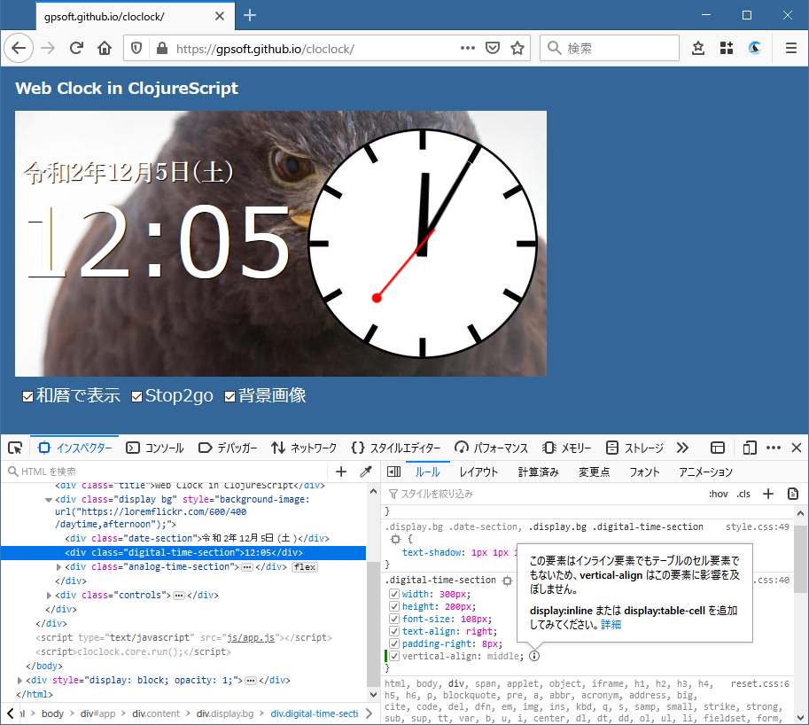

これを見ると、時刻を表示する`div`のCSSに`vertical-align`を設定してあるのですが、それが効いてない、ということが分かります(薄いグレーになってる)。

### JavaScriptのデバッグや実験

表示中のページのJavaScriptをデバッグしたり、任意のJavaScriptコードをお試しで動かしてみることができます。

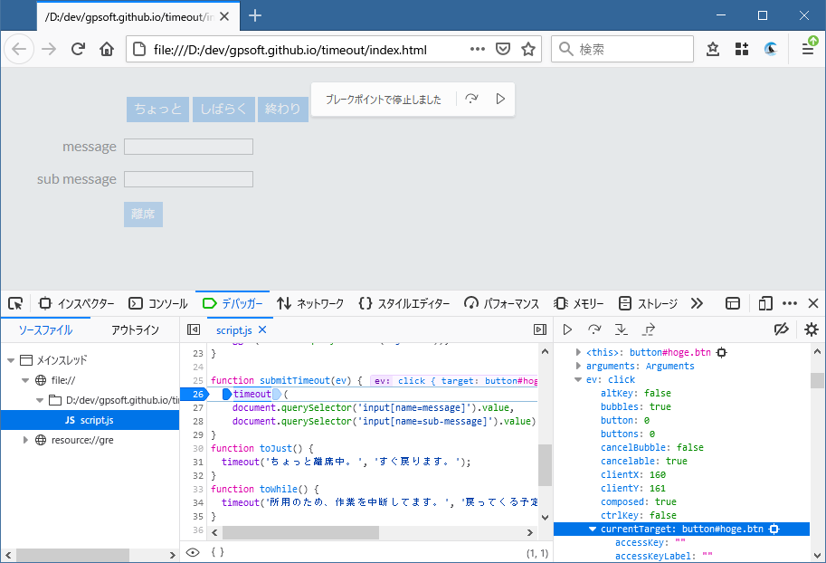

ここでは、クリックイベントが来たところにブレークポイントを仕込み、ブレークしたところで、イベントオブジェクトの`currentTarget`プロパティを調べています。

### ネットワークの監視

ブラウザとサーバとの通信内容をモニターできます。

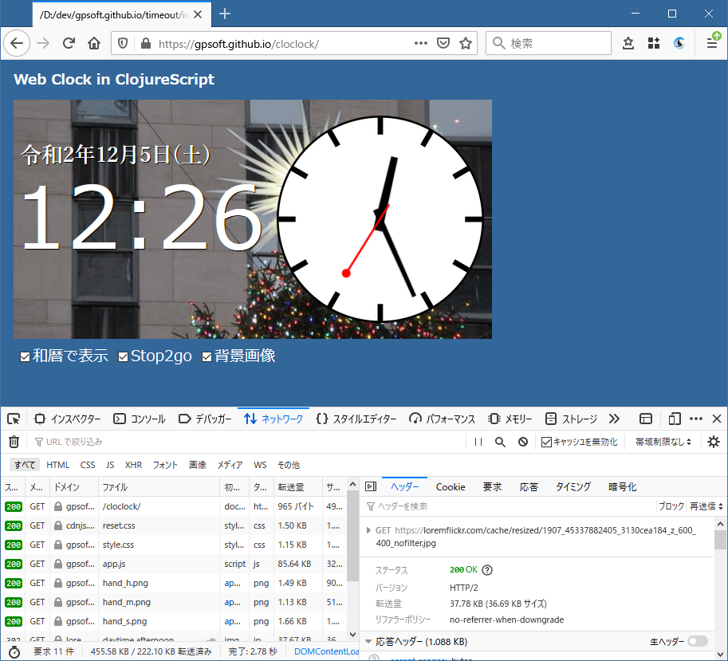

サーバに送ったリクエストのパラメータの内容を確認したり、そもそもリクエストが送信されてるのか? レスポンスの内容は期待通りか? そういった情報が、デバッグの助けになります。

## 起動方法

WindowsやLinuxの人は、ブラウザでショートカットキー`Ctrl+Shift+I`、あるいは`F12`キーを押すと、開発者ツールが起動すると思います。Macの人は、`Cmd+Opt+I`です。

うまく起動できない場合は、ブラウザのメニューから起動しましょう。

- Firefox ...メニュー → ウェブ開発 → 開発ツール
- Chrome ...Menu → More tools → Developer tools
- Safari ...メニュー → 開発 → Webインスペクタを表示

Safariの場合は、まずSafari → 環境設定 → 詳細から、「メニューバーに"開発"メニューを表示」をチェックしておく必要があります。

##### Firefox
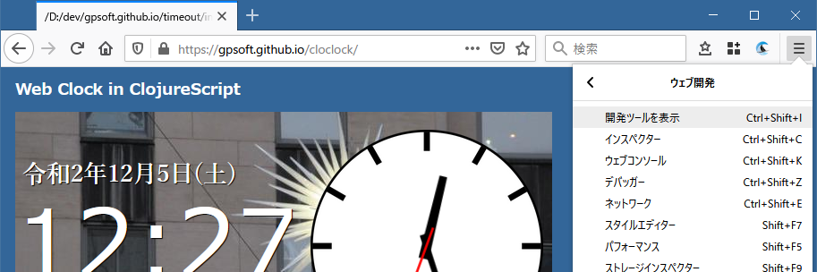

##### Chrome
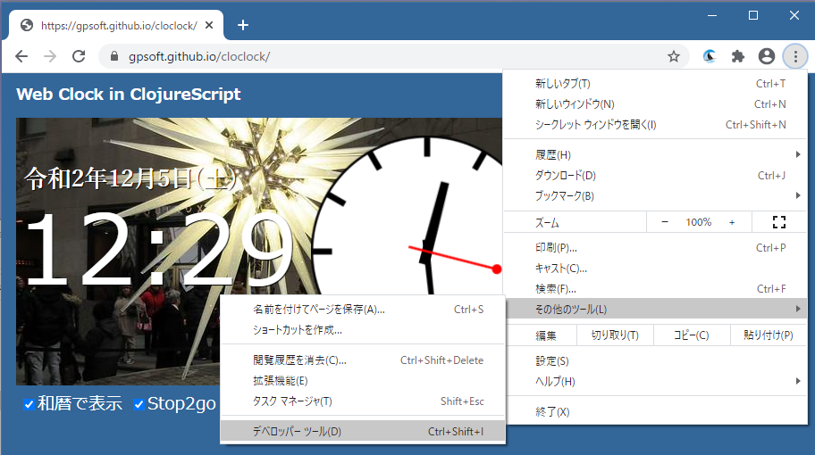

## 画面レイアウト

起動した開発者ツールの画面は、こんなレイアウトになっています。

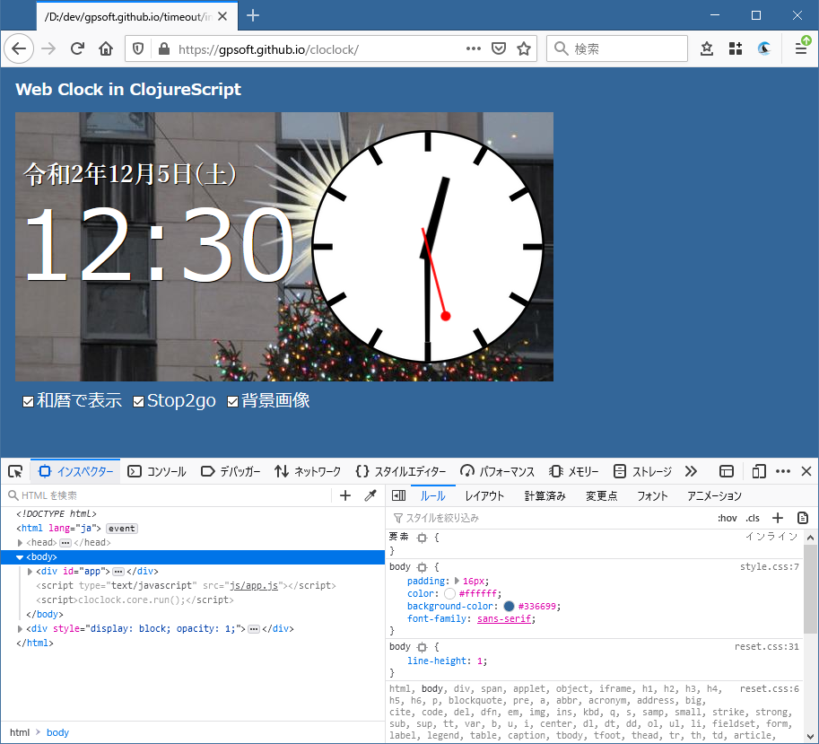

開発者ツールのウィンドウは、ブラウザ本体のウィンドウにドックさせたり、切り離したり、好みの位置へ移動できます。

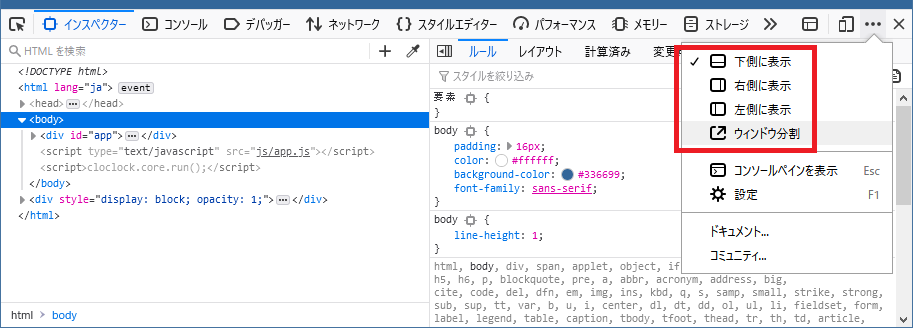

ウィンドウ上部には、タブが並んでいます。使いたい機能に応じてタブを切り替えます。

## HTMLやCSSの調査

まずは、Firefoxの`インスペクター`タブ、Chromeなら`Elements`タブを選びましょう。ここは、HTMLやCSSに関する情報の宝庫です。

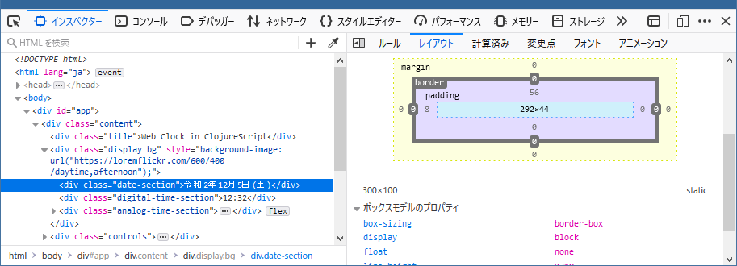

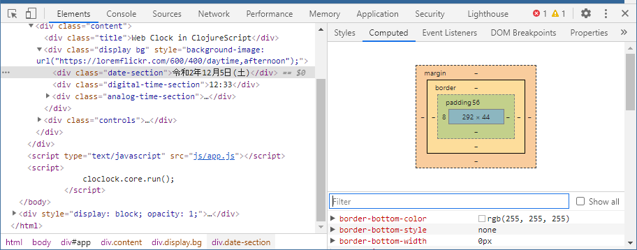

左側にHTMLが表示され、そこで選択したHTML要素に適用されているCSSスタイルが右側に表示されています。

この場で、タグの内容やCSSスタイルの内容を変更すれば、それが即、ページに反映されるので、効率よく試行錯誤することができます。

## JavaScriptのデバッグ

JavaScriptの動きを調べたいときは、Firefoxの`デバッガー`タブ、Chromeなら`Sources`タブを選びます。

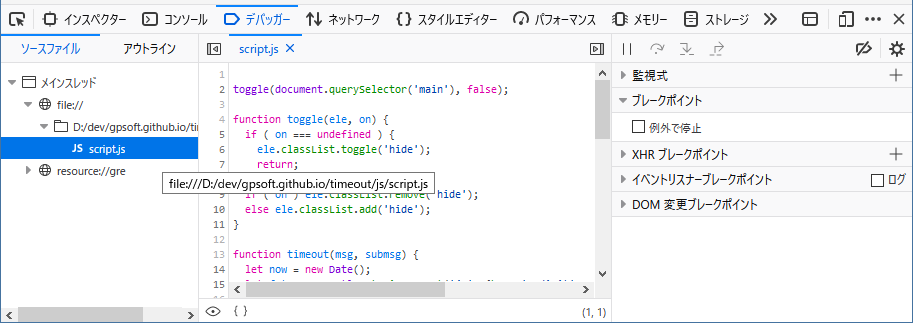

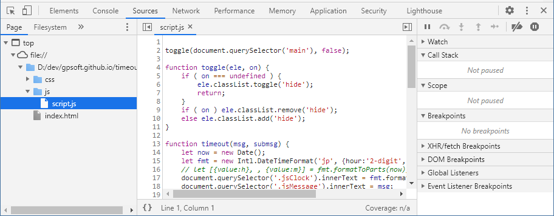

左側のツリーからデバッグしたいスクリプトを選ぶと、ソースコードが表示されます。ブレークポイントを仕込んだり、ステップ実行したり変数の値を見ながら、コードの動きを確認できます。

## コンソールの活用

`コンソール`/`Console`タブには、各種のエラーメッセージが表示されます。JavaScriptで`console.log()`したメッセージも、ここに表示されます。

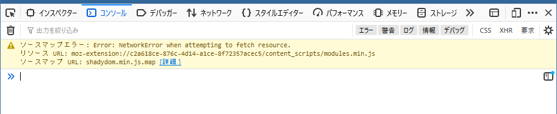

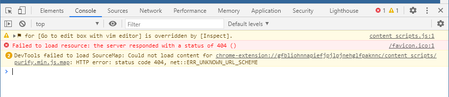

また、コンソールに任意のJavaScriptコードを打ち込んで実行してみることができます。ちょっとした実験に便利です。

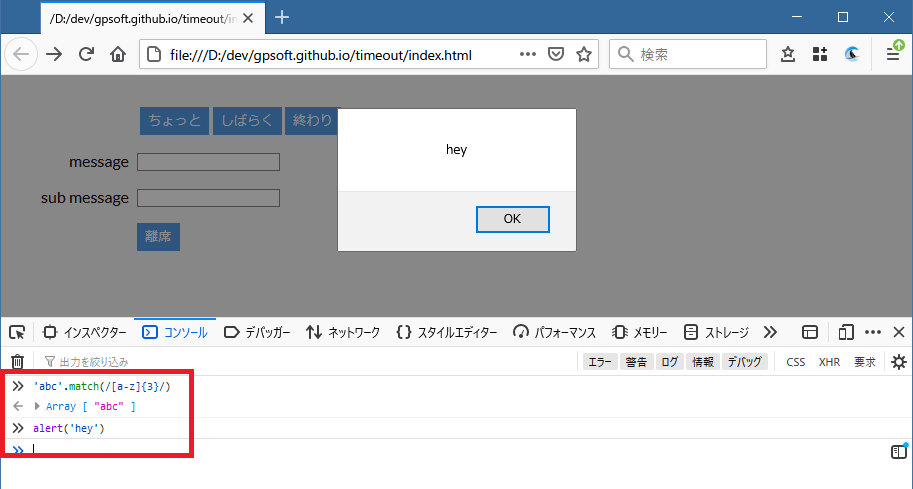

## ネットワークの監視

`ネットワーク`/`Network`タブには、ブラウザと外部との通信内容がすべて表示されます。

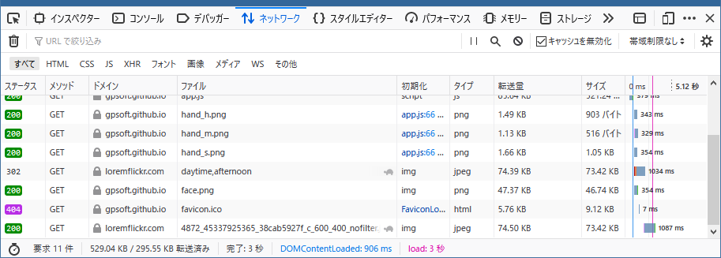

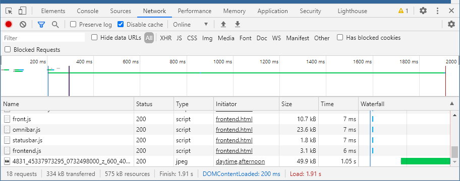

CSSファイルや画像ファイルを取得する様子も表示されるのが邪魔な場合は、HTML(Document)やAjax(XHR)だけをフィルタリングして表示することもできます。

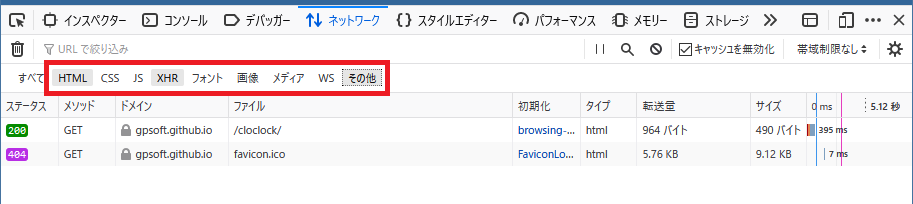

ブラウザとサーバの通信には、HTTPプロトコルが使われます。HTTPのメッセージは、ヘッダ部とボディ部に分かれます。例えば…

- サーバは、GETレスポンスのボディ部に、HTMLの内容を乗せる
- ブラウザは、POSTリクエストのボデイ部に、リクエストパラメータを乗せる
- Web APIを呼んだ場合は、そのレスポンスボディにはJSONデータが来る
- サーバは、レスポンスヘッダ経由でクッキーをブラウザにセットする

などなど、通信内容を調べると、Webアプリの様々な動きを分析できます。

## まとめ

プログラムが期待通りに動かないときは、どこまでが期待通りで、どこから期待と外れてしまうのかを絞り込んでいく必要があります。そのためには、まず、プログラムがどう動いているのかを知ることが肝心です。それを手助けしてくれるのが開発者ツールなのです。
